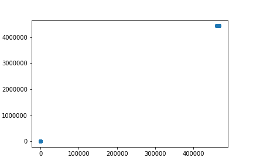
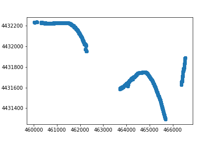
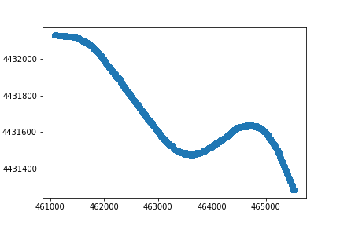
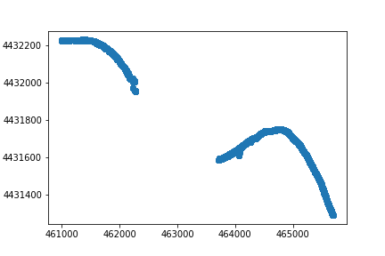
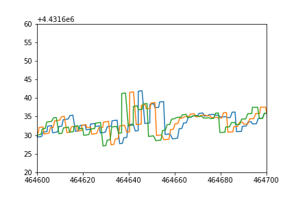

## 问题说明

使用HMM测试数据需要正确的NGSIM格式数据

使用AGen测试数据需要正确的NGSIM格式数据及车道信息

1号表示2018-12-04-10-47-15的数据

2号表示2018-12-04-10-59-21的数据

以下为我在处理数据时遇到的问题：

### 车道数据

##### 车道数据开头结尾GPS坐标有严重偏移

1号

2号

##### 2号数据断裂

为解决便宜问题，截取Global坐标x项在[461000, 466000]的部分。截取后

1号

2号数据车道仍存在断裂情况，无法继续处理

##### 车道信息噪声太大

使用1号数据绘制3条车道，但是噪音太大无法用于Agen所需的车道信息，1号3条车道的局部图如下

##### 车道宽度变化较大

最小时仅有1米多，不符合现实情况，而且变化较多

>Lane_Width:    1.668    1.668    1.698    1.698 

##### 理想情况

理想情况下请提供与之前邮件中发送的样例一样的格式（一个txt文件中有多条轨迹，每条轨迹用多个点描述连成的线段）。

#### NGSIM格式

##### Local_X & Local_Y

Local_X应当是车辆距离最左侧车道边界的距离

Local_Y应当是车辆距离起点边界的前行距离

这两项当前是相对于ego的相对距离

##### Vehicle_ID

一辆车出现掉帧的情况时，请使用插值补上掉帧的数据，或，使用新的id标记此辆车

##### Lane_ID

该项在数据中大量缺失，可以由lane宽度及Local_X的值获得，最左侧为1车道

##### Global_Time & Frame_ID

采样频率不固定，每个Frame之间的间隔应当是相同的，ngsim使用10Hz的采样频率，间隔0.1s

##### v_length & v_width

这两项应当是车的真实尺寸，当前在数据中一辆车的长宽可能会出现变化，且去最大值后仍会有长宽某项为0.X米的情况，不符合真实情况，最大长度样例如下：

> 0: 4.8700000000000001,
> 611: 6.1980000000000004,
> 919: 0.35299999999999998,
> 928: 0.20000000000000001,

##### v_Acc

数据全部缺失，可以v_Vel获得

